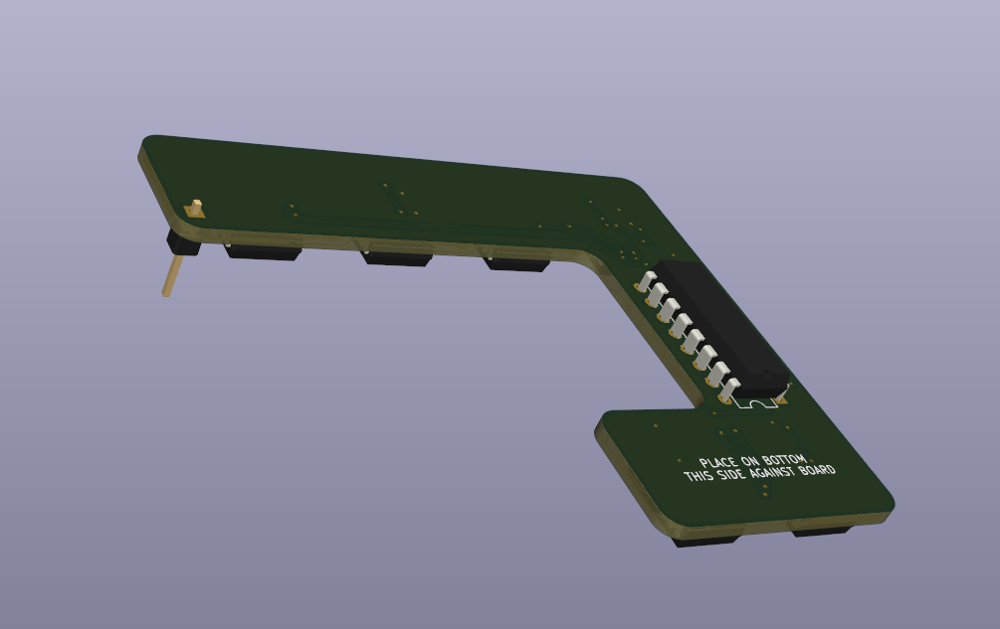
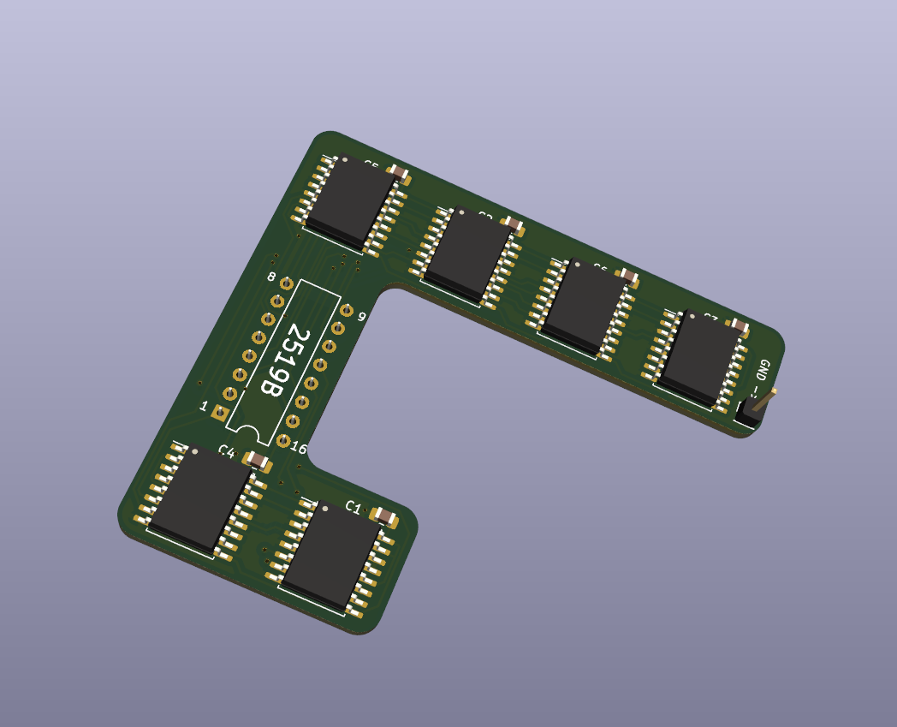
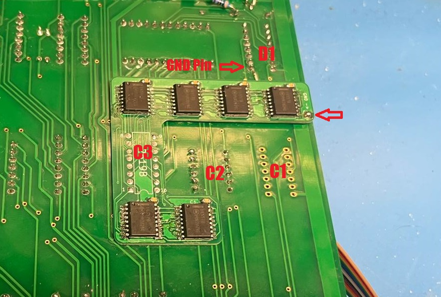

# Apple I 2519B replacement

This is my own version of the PCB for replacing the 2519 IC on the Apple 1 motherboard.

This is based on [this project](https://oshwlab.com/szillat/2519-fixed) and [this SMD version](https://www.applefritter.com/content/2519-smd-replacement).

The main difference between these and this one is that this PCB is soldered on the bottom of the Apple 1 motherboard, leaving the socket on top free for a dummy-ic or simply to leave it empty.

Disclaimer: I designed this PCB two years ago, and the layout might not be optimal.

## Pictures

## Installation

See the above picture for how the board attaches to the motherboard.

I recommend installing a machined pin socket into position C3 and soldering it in place.
Place the daughterboard on the bottom as shown such that the DIP footprint on the board are located on the solder joints of the socket.
Make sure the labeled pin numbers match the pins on the IC - remember that this is the bottom and so the numbering is flipped.

Add more solder to the DIP footprint to attach the daughterboard. I had my batch of PCBs manufactured at 0.8mm thickness (many PCB manufacturers can do this at no additional cost)
which might help with this step.

Add a small wire from a ground-pad of your choice (I used pin 1 of the IC at location D1) to the labelled GND-pad on the daughterboard.
Note that the wide trace running directly under the PCB at this location is not connected to GND, making it unsuitable for this purpose.
  
I used some wire-wrapping wire (30AWG) and routed it underneath the daughterboard (there is a small gap between the two PCBs). This prevents this wire from getting caught on anything.

If the wrong characters are shown on screen, refer to the character generator IC's character map to find which of the six shift registers is not working and check your solder joints for missing connections or bridges.

(I have written more about the build process of my own Apple 1 [here](https://www.applefritter.com/content/another-apple-1-lives))
## BOM

The PCB uses six MC14557B shift register ICs and a 100nF decoupling capacitor for each.

|Reference|Part No.|Link|
|---|---|---|
|U1,U2,U3,U4,U5,U6|MC14557B|https://eu.mouser.com/ProductDetail/onsemi/MC14557BDWR2G?qs=g2rIOKKlpobUZ7ljsbuxeQ%3D%3D|
|C1,C2,C3,C4,C5,C6|Ceramic Capacitor 16V 0805 0.1uF|generic|

